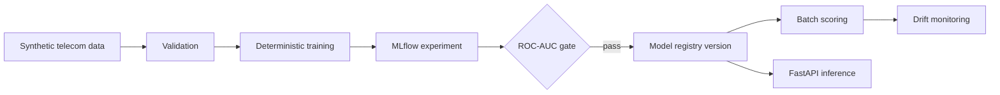

# Customer Churn MLOps

[](https://github.com/anveshsvemuri/customer-churn-mlops/actions/workflows/ci.yml)

A production-style, PII-free reference platform for telecom churn prediction. It demonstrates the full path from deterministic data generation and validation to model promotion, batch scoring, drift signals, and online inference.

## Architecture



## What this demonstrates

- Reproducible PII-free dataset generation
- Explicit feature and target validation
- Scikit-learn pipeline with deterministic split and evaluation
- MLflow experiment lineage for parameters, metrics, tags, and model artifacts
- Promotion gate before optional model-registry version creation
- Batch prediction and PSI-based feature-drift monitoring
- Validated FastAPI request/response contracts
- Docker packaging and GitHub Actions quality gates
- Responsible-use model card

## Run locally

```bash
python -m venv .venv
source .venv/bin/activate
pip install -e '.[dev]'
churn-mlops train
uvicorn churn_mlops.api:app --reload
```

Example request:

```bash
curl -X POST http://localhost:8000/predict -H 'content-type: application/json' -d '{
  "tenure_months": 6,
  "monthly_charges": 105,
  "support_tickets": 4,
  "contract_months": 1,
  "autopay": 0,
  "streaming_services": 2
}'
```

Generated datasets and model artifacts are intentionally excluded from Git. Run `make train` before building the Docker image.

## Track and register a model

MLflow is optional so the core API image stays small. A local SQLite backend gives
reproducible experiment history and registry support:

```bash
pip install -e '.[dev,tracking]'
churn-mlops train \
  --tracking-uri sqlite:///mlflow.db \
  --experiment-name telecom-churn \
  --registered-model-name telecom-churn
mlflow ui --backend-store-uri sqlite:///mlflow.db
```

The CLI validates the ROC-AUC promotion gate before it calls the tracker. Each run
records the seed, row count, feature contract, decision threshold, evaluation
metrics, PII classification, and serialized pipeline. Supplying a registered model
name creates a new model version only for a candidate that passed the gate. Local
MLflow databases and run artifacts are ignored by Git.

## Monitor feature drift

The monitoring command compares an approved reference dataset with a current batch,
then writes an aggregate-only JSON report. It combines population stability index
(PSI), standardized mean shift, severity labels, and an overall deployment signal:

```bash
churn-mlops monitor \
  --reference data/reference.csv \
  --current data/current.csv \
  --output artifacts/drift-report.json \
  --threshold 0.25 \
  --fail-on-drift
```

PSI below `0.10` is labeled stable, `0.10–0.25` moderate, and `0.25` or above
significant. `--fail-on-drift` returns exit code 2 when any feature crosses the
configured threshold, allowing the command to gate scheduled scoring or retraining
workflows. Reports contain only feature-level aggregates—never customer rows or PII.
See the committed [sample drift report](docs/sample-drift-report.json) for a verified
1,000-row demonstration with a simulated billing-distribution shift.

## Roadmap

- Delayed-label performance evaluation and monitoring dashboard
- Cloud object storage and Terraform deployment module
- Grounded retention-strategy copilot powered by the separate Data Platform Copilot project
