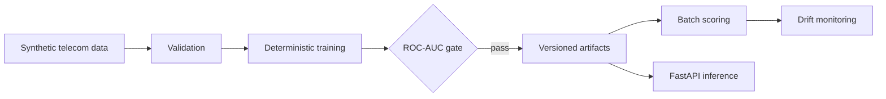

# Customer Churn MLOps

[](https://github.com/anveshsvemuri/customer-churn-mlops/actions/workflows/ci.yml)

A production-style, PII-free reference platform for telecom churn prediction. It demonstrates the full path from deterministic data generation and validation to model promotion, batch scoring, drift signals, and online inference.

## Architecture



## What this demonstrates

- Reproducible PII-free dataset generation
- Explicit feature and target validation
- Scikit-learn pipeline with deterministic split and evaluation
- Promotion gate and JSON metrics artifact
- Batch prediction and lightweight drift monitoring
- Validated FastAPI request/response contracts
- Docker packaging and GitHub Actions quality gates
- Responsible-use model card

## Run locally

```bash
python -m venv .venv
source .venv/bin/activate
pip install -e '.[dev]'
churn-mlops train
uvicorn churn_mlops.api:app --reload
```

Example request:

```bash
curl -X POST http://localhost:8000/predict -H 'content-type: application/json' -d '{
  "tenure_months": 6,
  "monthly_charges": 105,
  "support_tickets": 4,
  "contract_months": 1,
  "autopay": 0,
  "streaming_services": 2
}'
```

Generated datasets and model artifacts are intentionally excluded from Git. Run `make train` before building the Docker image.

## Roadmap

- MLflow experiment tracking and registry adapter
- Evidently monitoring report and delayed-label evaluation
- Cloud object storage and Terraform deployment module
- Grounded retention-strategy copilot powered by the separate Data Platform Copilot project

